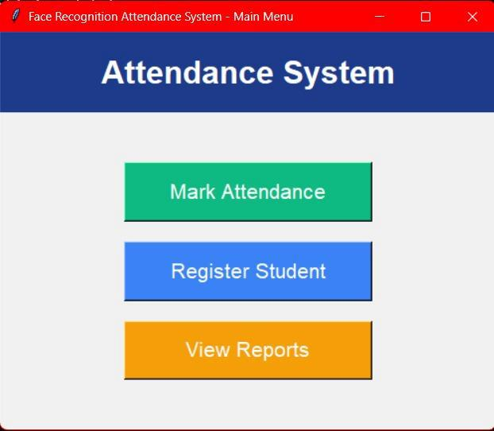
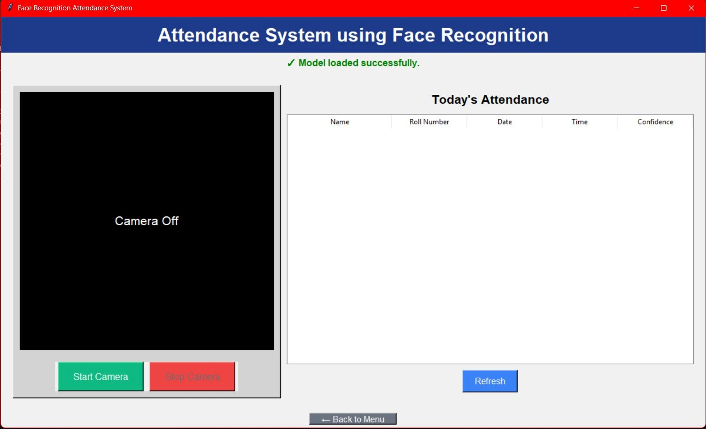
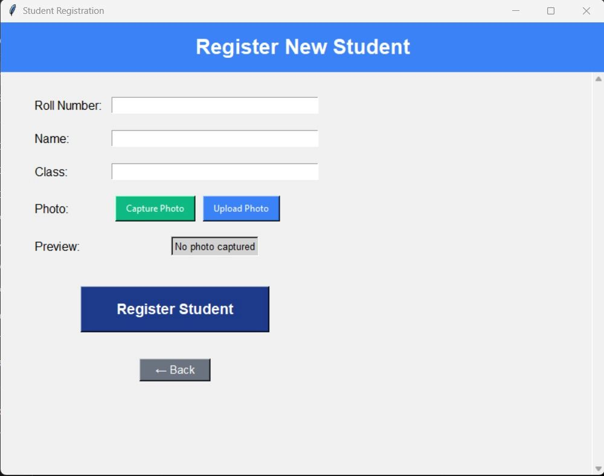
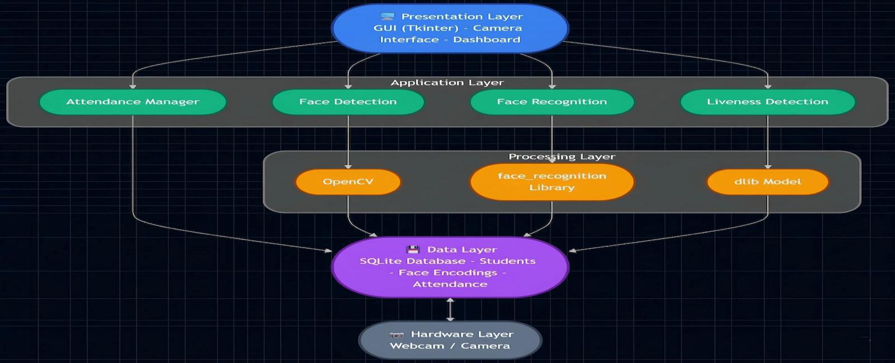
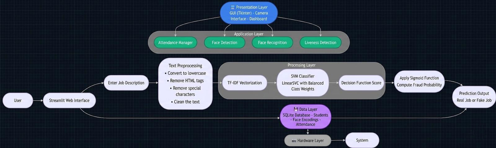
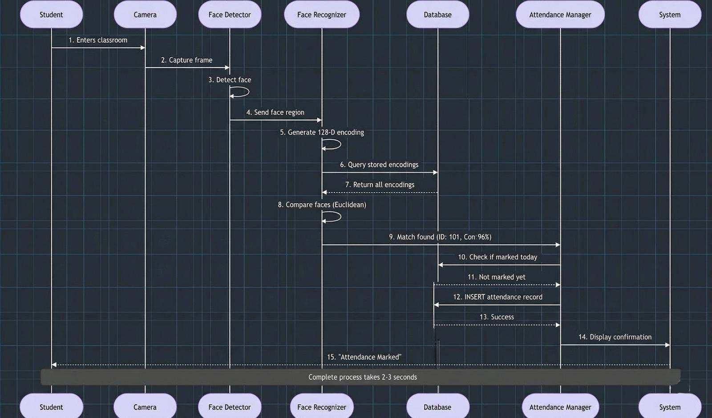

# Attendance System Using Face Recognition

## 📖 Overview

Attendance System Using Face Recognition is a computer vision-based attendance management application developed using Python and OpenCV. The system automatically detects and recognizes registered users through a webcam and marks attendance without manual intervention.

The project aims to eliminate manual attendance processes, reduce human errors, prevent proxy attendance, and provide a faster and more reliable attendance management solution.

---

## 🚀 Features

* Face Detection using OpenCV
* Face Recognition using facial encodings
* Automatic Attendance Marking
* Student Registration Module
* Attendance Report Generation
* Real-Time Webcam Monitoring
* Attendance Record Storage
* User-Friendly GUI Interface
* Duplicate Attendance Prevention
* SQLite Database Integration

---

# 📸 Project Screenshots

## User Interface

<p align="center">
  
  
</p>

<p align="center">
  <b>Main Menu</b> &nbsp;&nbsp;&nbsp;&nbsp;&nbsp;&nbsp;&nbsp;&nbsp;&nbsp;&nbsp;&nbsp;&nbsp;&nbsp;&nbsp;&nbsp;&nbsp;&nbsp;&nbsp;&nbsp;&nbsp;&nbsp;&nbsp;&nbsp;&nbsp;&nbsp;&nbsp;&nbsp;&nbsp;&nbsp;&nbsp;&nbsp;&nbsp;&nbsp;&nbsp;&nbsp;&nbsp; <b>Attendance Marking Interface</b>
</p>

<p align="center">
  
  
</p>

<p align="center">
  <b>Student Registration Interface</b> &nbsp;&nbsp;&nbsp;&nbsp;&nbsp;&nbsp;&nbsp;&nbsp;&nbsp;&nbsp;&nbsp;&nbsp;&nbsp;&nbsp;&nbsp;&nbsp;&nbsp;&nbsp;&nbsp;&nbsp;&nbsp;&nbsp;&nbsp;&nbsp; <b>Attendance Reports Interface</b>
</p>

---

## 🏗️ System Architecture

<p align="center">
  
</p>

The system follows a layered architecture consisting of:
- Presentation Layer (Tkinter GUI)
- Application Layer (Attendance Manager, Face Detection, Face Recognition)
- Processing Layer (OpenCV, face_recognition, dlib)
- Data Layer (SQLite Database)
- Hardware Layer (Webcam)

---

## 📋 Use Case Diagram

<p align="center">
  
</p>

This diagram illustrates the interactions between users and the attendance management system.

---

## 🔄 Sequence Diagram

<p align="center">
  
</p>

The sequence diagram shows the complete attendance marking workflow, from face capture to attendance storage in the database.

---

## 🛠 Technology Stack

### Programming Language

* Python

### Libraries & Frameworks

* OpenCV
* face_recognition
* dlib
* NumPy
* Pandas
* Pillow
* Tkinter

### Database

* SQLite

---

## 📂 Project Workflow

1. Register student/user
2. Capture face images
3. Generate face encodings
4. Store user details in database
5. Start camera feed
6. Detect faces in real time
7. Match faces with stored encodings
8. Mark attendance automatically
9. Generate attendance reports

---

## 🏗 System Architecture

The system consists of four major modules:

### 1. Image Acquisition

Captures images using webcam or camera.

### 2. Face Detection

Detects human faces from video frames using OpenCV.

### 3. Face Recognition

Matches detected faces against registered facial data.

### 4. Attendance Management

Records attendance with date and time and generates reports.

---

## 📊 Key Benefits

* Improves attendance accuracy
* Reduces manual effort
* Prevents proxy attendance
* Saves classroom and office time
* Contactless attendance management
* Easy attendance tracking and reporting

---

## 💻 Installation

### Clone Repository

```bash
git clone https://github.com/yourusername/attendance-system-face-recognition.git
cd attendance-system-face-recognition
```

### Create Virtual Environment

```bash
python -m venv attendance_env
```

### Activate Environment

Windows:

```bash
attendance_env\Scripts\activate
```

Linux/macOS:

```bash
source attendance_env/bin/activate
```

### Install Dependencies

```bash
pip install opencv-python
pip install face_recognition
pip install dlib
pip install numpy
pip install pandas
pip install Pillow
pip install scipy
pip install cmake
```

### Run Application

```bash
python main.py
```

---

## 📁 Database Structure

### Students Table

* Student ID
* Roll Number
* Name
* Class
* Section
* Email
* Phone Number

### Face Encodings Table

* Encoding ID
* Student ID
* Face Encoding

### Attendance Table

* Attendance ID
* Student ID
* Date
* Time
* Status
* Confidence Score

---

## 📸 Application Modules

### Main Menu

* Mark Attendance
* Register Student
* View Reports

### Attendance Module

* Live face recognition
* Automatic attendance marking

### Student Registration

* Add student information
* Capture face images

### Reports Module

* View attendance history
* Attendance analytics

---

## 🎯 Future Enhancements

* Cloud Database Integration
* Mobile Application Support
* Multi-Camera Support
* Advanced Deep Learning Models
* Email/SMS Notifications
* Institution ERP Integration
* Enhanced Security & Encryption


## 📜 License

This project was developed as a Mini Project for the Bachelor of Technology in Computer Science and Engineering (Data Science) at Chinmaya Vishwa Vidyapeeth.

Feel free to use and improve this project for educational and research purposes.
